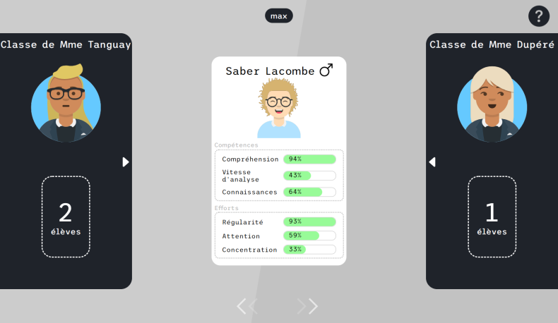
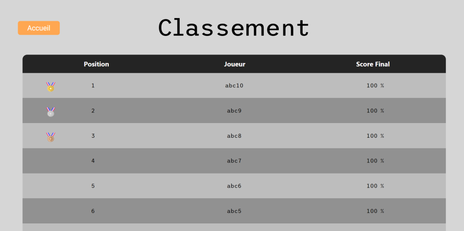
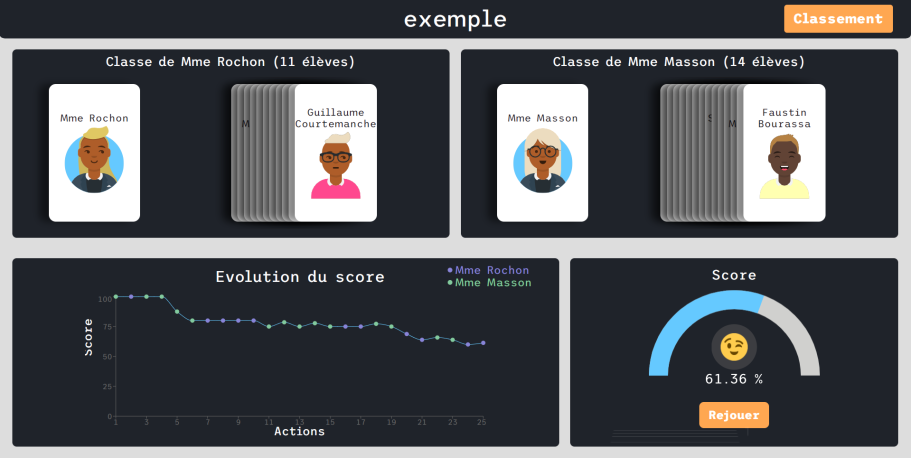

<h1 style="text-align:center;">The Director</h1>

Projet T3 sur le thème de la méritocratie

 

Table des matières
 
<ol>
    <li>Présentation</li>
    <li>Installation</li>
    <li>A propos</li>
</ol>

## Présentation

The Director est un jeu dis "serious game" afin d'aborder la notion de méritocratie qui occupe actuellement notre système scolaire :

Choississez vous même la répartition des élèves ! Attention aux caractérisques des élèves ainsi que des professeurs !

Obtenez un classement parmi les autres utilisateurs !

Analysez vos choix et améliorer-les pour la prochaine partie !

## Installation

Aucune installation au préalable n'est requise ! Cependant il faudra avoir javascript activé dans votre navigateur.  

Il vous suffit de vous munir d'un navigateur à jour : 
<ol>
    <li>Firefox</li>
    <li>Chrome</li>
    <li>Safari</li>
    <li>Tout sauf Internet Exploreur</li>
</ol>
 Et cliquez le lien suivant afin de vous lancer dans l'aventure : 
<a href='https://the-director-game.web.app/'>https://the-director-game.web.app/</a>

## A propos

Language et framework utilisé :
<ol>
    <li>HTML</li>
    <li>NodeJS</li>
    <li>React</li>
    <li>MongoDB</li>